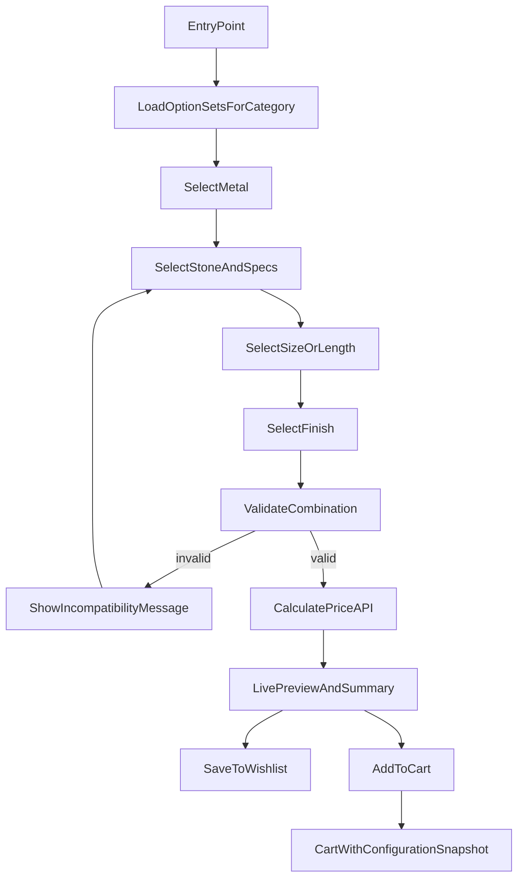
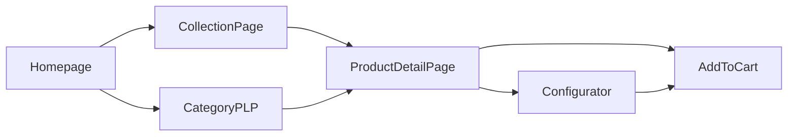
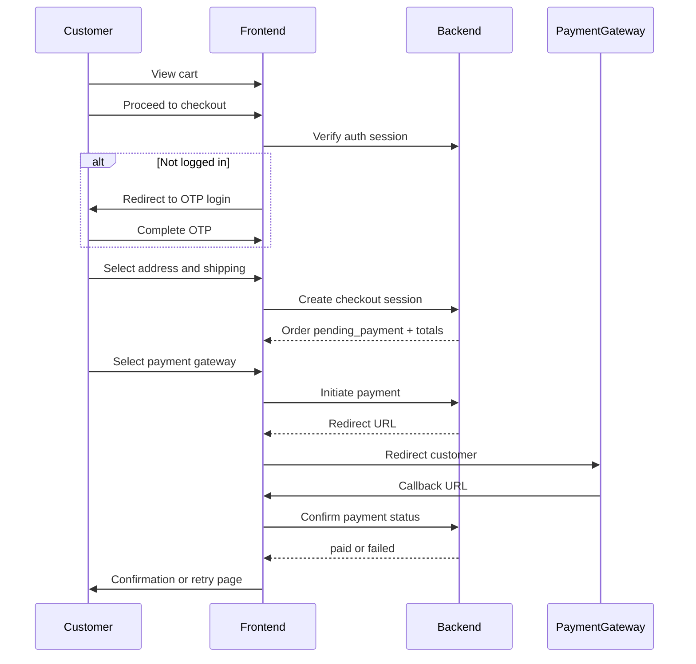
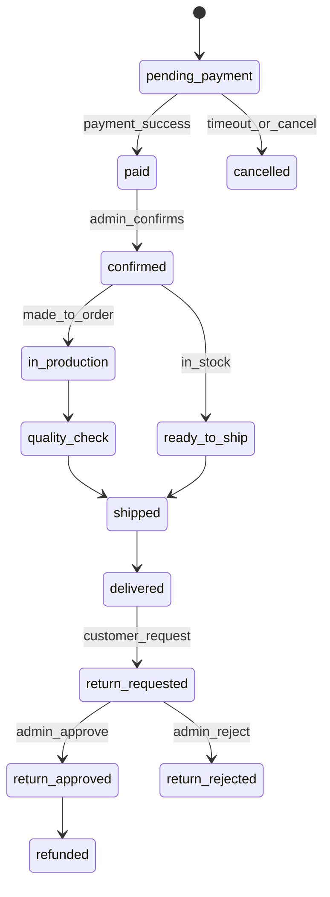
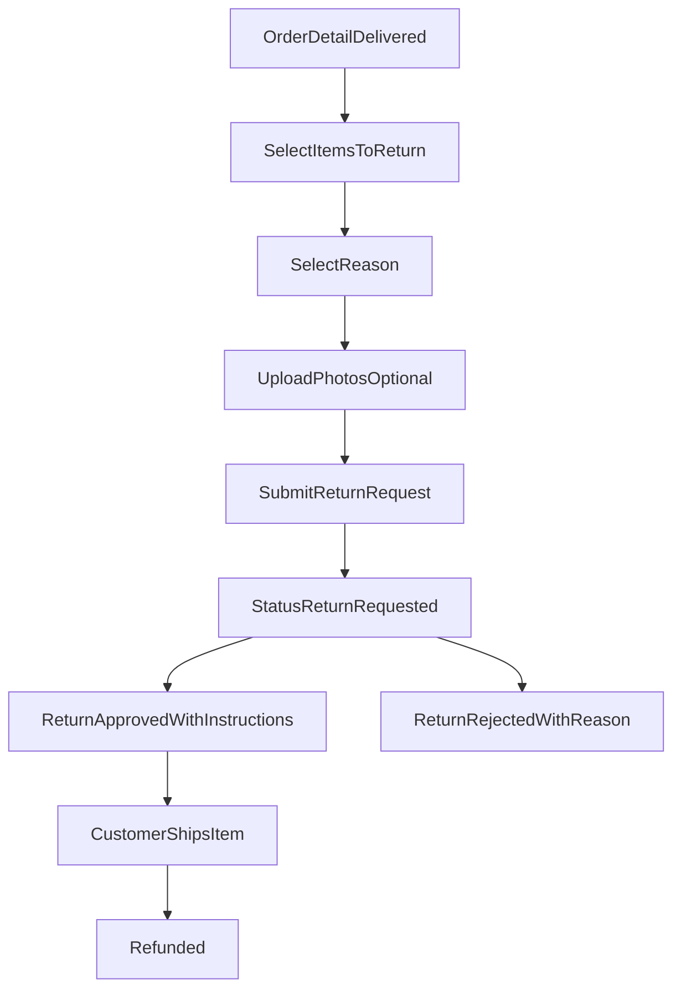

# Rahil Gallery — Business Logic Documentation

> **Version:** 1.0  
> **Scope:** Frontend (Next.js) business rules and workflows. Backend is a separate project with an existing API.  
> **Status:** Assumptions marked with ⚠️ until backend API contract is confirmed.

---

## Table of Contents

1. [Product Domain](#1-product-domain)
2. [Custom Configurator Workflow](#2-custom-configurator-workflow)
3. [Customer Journeys](#3-customer-journeys)
4. [Cart & Checkout Rules](#4-cart--checkout-rules)
5. [Order Lifecycle](#5-order-lifecycle)
6. [Returns & Refunds](#6-returns--refunds)
7. [Reviews](#7-reviews)
8. [Admin Workflows](#8-admin-workflows)
9. [i18n & RTL Business Rules](#9-i18n--rtl-business-rules)
10. [Integration Boundaries](#10-integration-boundaries)
11. [Non-Functional Requirements](#11-non-functional-requirements)

---

## 1. Product Domain

### 1.1 Brand Positioning

Rahil Gallery is a **luxury, high-end jewelry** brand. The storefront prioritizes editorial presentation, craftsmanship storytelling, and a premium purchase experience. Products span ready-to-ship inventory and made-to-order pieces with extended lead times.

### 1.2 Category Tree

```
Jewelry
├── Rings
│   ├── Engagement
│   ├── Wedding
│   └── Fashion
├── Necklaces
│   ├── Pendants
│   └── Chains
├── Earrings
│   ├── Studs
│   ├── Hoops
│   └── Drop
├── Bracelets
│   ├── Bangles
│   └── Chain bracelets
├── Sets
│   └── Coordinated collections (ring + necklace + earrings, etc.)
└── Custom
    └── Fully configurable pieces (configurator-first)
```

Each product belongs to **one primary category** and may belong to **one or more collections** (editorial groupings, e.g. "Spring 2026", "Bridal", "Minimal Gold").

### 1.3 Product Types

| Type | Description | Inventory model |
|------|-------------|-----------------|
| **Standard** | Fixed SKU with predefined variants | Ready stock and/or made-to-order |
| **Configurable** | Base product + configurator options | Typically made-to-order |
| **Set** | Bundle of linked products or unified set SKU | Per component availability |

### 1.4 Variant Model

Variants are composed of **attribute dimensions**. Not all dimensions apply to every category.

| Attribute | Applies to | Example values |
|-----------|------------|----------------|
| **Metal** | All | 18K yellow gold, 18K white gold, 18K rose gold, platinum |
| **Stone type** | Most | Diamond, sapphire, emerald, ruby, pearl, none |
| **Stone cut** | Stone pieces | Round, princess, oval, emerald, pear |
| **Carat** | Stone pieces | 0.25, 0.5, 1.0, 1.5, 2.0+ |
| **Stone color / clarity** | Diamonds | G/VVS1, H/VS2, etc. ⚠️ exact grades TBD |
| **Ring size** | Rings | EU/US/IR sizes; configurable ring sizer guide |
| **Chain length** | Necklaces, bracelets | 40cm, 45cm, 50cm, adjustable |
| **Finish** | All | Polished, brushed, matte, hammered |
| **Earring backing** | Earrings | Push back, screw back, lever back |

**Variant identity:** A sellable SKU = product ID + unique combination of selected attributes. The backend is the source of truth for valid combinations.

### 1.5 Stock vs Made-to-Order

| Fulfillment mode | Display rule | Cart behavior |
|------------------|--------------|---------------|
| **In stock** | "Available — ships in 1–3 business days" | Quantity capped by inventory |
| **Made-to-order** | "Made to order — estimated X weeks" | Quantity unlimited (⚠️ max 1 per custom config recommended) |
| **Mixed (product level)** | Show earliest/labeled per line item | Each line item carries its own lead time |
| **Out of stock** | "Unavailable" — cannot add to cart | Hidden from "In stock" filter |

**Availability display on PDP:**
- In stock: green/neutral badge + quantity if low stock (⚠️ threshold: ≤3 units)
- Made-to-order: lead time badge prominently shown
- Out of stock: disable Add to Cart; offer "Notify me" ⚠️ optional v1.1

### 1.6 Pricing Rules

- **Currency:** IRR (تومان) only in v1
- **Display:** Locale-formatted — FA locale may use Persian numerals; EN uses Western numerals
- **Base price:** Defined per product or per variant SKU on backend
- **Configurator modifiers:** Each option choice may add a fixed or percentage adjustment; frontend calls **price calculation API** on every meaningful option change
- **Sets:** Bundle price may be less than sum of components (backend defines)
- **Tax/VAT:** ⚠️ Included in displayed price or shown at checkout — confirm with backend (assume **included** for luxury B2C Iran)
- **No guest pricing tiers** — logged-in users only can purchase

### 1.7 Collections & Editorial Groupings

Collections are **curated, non-exclusive** groupings for marketing and navigation:

- Homepage hero may link to a collection
- PLP can be filtered by collection
- A product may appear in multiple collections
- Collections have: slug, bilingual title/description, hero image, sort order, publish window (optional)

---

## 2. Custom Configurator Workflow

The configurator applies to **all categories** with **category-specific option sets**. Entry points:

1. PDP "Customize" on configurable products
2. Category landing "Design your own"
3. `/custom` dedicated configurator page

### 2.1 Flow Diagram



### 2.2 Per-Category Option Sets

#### Rings
1. Metal → 2. Stone type → 3. Cut → 4. Carat → 5. Color/clarity (if diamond) → 6. Ring size → 7. Finish  
Optional: engraving text (⚠️ max 20 chars, extra fee)

#### Necklaces
1. Metal → 2. Pendant vs chain-only → 3. Stone options (if pendant) → 4. Chain length → 5. Finish

#### Earrings
1. Metal → 2. Style (stud/hoop/drop) → 3. Stone options → 4. Backing type → 5. Finish  
Note: Pairs sold as single unit; quantity = 1 pair

#### Bracelets
1. Metal → 2. Style (bangle/chain) → 3. Stone/charms (optional) → 4. Length or size → 5. Finish

#### Sets
1. Select set template → 2. Configure each component (sub-flows above) → 3. Review combined preview → 4. Unified price

### 2.3 Validation Rules

| Rule | Behavior |
|------|----------|
| Incompatible metal + stone | Option disabled with tooltip explaining why |
| Carat exceeds setting capacity | Block selection; suggest alternate setting |
| Ring size out of range | Show size guide; offer "contact for custom size" ⚠️ |
| Unavailable combination | Real-time validation via API before Add to Cart |
| Engraving on unsupported finish | Hide engraving option |

Frontend **must not** compute valid combinations locally long-term; backend validation is authoritative on submit.

### 2.4 Lead Time Calculation

- **In-stock variant selected:** Use product lead time (1–3 days)
- **Made-to-order configuration:** Base lead time + modifiers:
  - Custom stone sourcing: +2–4 weeks ⚠️
  - Engraving: +3–5 days ⚠️
  - Complex set: longest component lead time
- Display **range** when uncertain: "4–6 weeks"
- Lead time shown on configurator summary, cart line, checkout, order confirmation

### 2.5 Cart Line Item — Configuration Snapshot

When a configured piece is added to cart, store immutable snapshot:

```json
{
  "productId": "uuid",
  "category": "rings",
  "configuration": {
    "metal": "18k-yellow-gold",
    "stone": { "type": "diamond", "cut": "round", "carat": 1.0, "grade": "G-VVS1" },
    "ringSize": "54",
    "finish": "polished",
    "engraving": null
  },
  "calculatedPrice": 125000000,
  "leadTimeDays": { "min": 28, "max": 42 },
  "fulfillmentMode": "made_to_order",
  "previewImageUrl": "https://cdn.../preview.png",
  "configurationHash": "abc123"
}
```

If catalog prices change after add-to-cart, **honor price at add time** until cart expires (⚠️ cart TTL: 7 days) or user refreshes cart (backend policy).

---

## 3. Customer Journeys

### 3.1 Browse & Discover



**Touchpoints:**
- Homepage: hero, featured collections, new arrivals, editorial block, blog teaser
- Collection page: editorial header + product grid
- PLP: rich filters, sort, pagination
- PDP: gallery, variants/configurator, reviews, related products

### 3.2 Purchase Journey



**Account required:** Users cannot reach payment without authenticated session.

### 3.3 Account Journey

1. **Register / Login:** Phone number → OTP via SMS → session token
2. **Profile:** Name, email (optional), default ring size, language preference
3. **Addresses:** CRUD domestic Iran addresses (province, city, postal code, phone)
4. **Orders:** List + detail + status timeline
5. **Returns:** Initiate from delivered orders
6. **Reviews:** Submit from delivered orders
7. **Wishlist:** Save products and configured designs

### 3.4 Custom Order Journey

Same as purchase, with additional UX:
- Cart shows **extended lead time** per line
- Checkout summary includes made-to-order acknowledgment checkbox
- Order confirmation sets expectation: "Your piece is being crafted"

---

## 4. Cart & Checkout Rules

### 4.1 Cart Rules

| Rule | Detail |
|------|--------|
| Auth | Cart persists per user when logged in; ⚠️ merge anonymous cart on login if backend supports |
| Mixed fulfillment | Allowed — show split shipping note if in-stock ships before made-to-order |
| Quantity | In-stock: max = inventory; made-to-order: max 1 per unique configuration |
| Expiry | ⚠️ 7-day cart TTL (backend enforced) |
| Price refresh | On cart load, backend returns current prices; show notice if changed |

### 4.2 Checkout Steps

1. **Review cart** (editable)
2. **Shipping address** (select saved or add new — Iran domestic only)
3. **Shipping method** (⚠️ standard vs express — backend defines options)
4. **Order summary** (subtotal, shipping, discount, total)
5. **Payment gateway selection** (if multiple enabled)
6. **Place order & pay** → redirect to gateway
7. **Return URL** → success or failure page

### 4.3 Address Validation

- **Country:** Iran only (IR) — hard block on others
- **Required fields:** Full name, mobile, province, city, address line, postal code
- **Postal code:** 10-digit Iranian format validation (frontend pattern)

### 4.4 Shipping Cost

⚠️ **Assumption until API confirmed:**
- Flat rate for standard domestic shipping
- Free shipping above threshold (e.g. 50,000,000 IRR) — configurable in admin
- Made-to-order items may ship separately at no extra split fee

### 4.5 Payment Failure & Retry

| State | Customer action |
|-------|-----------------|
| Payment cancelled at gateway | Return to checkout with order in `pending_payment`; retry within ⚠️ 30 min |
| Payment failed | Show reason if available; retry or contact support |
| Timeout | Order auto-cancelled; cart items restored ⚠️ backend behavior |

### 4.6 Discounts / Coupons

⚠️ **v1.1** unless backend already supports — document hook: coupon code field at checkout, validated by API.

---

## 5. Order Lifecycle

### 5.1 Status Enum

| Status | Customer-visible label (EN) | Description |
|--------|-------------------------------|-------------|
| `pending_payment` | Awaiting payment | Order created, gateway not completed |
| `cancelled` | Cancelled | Unpaid timeout or user cancel |
| `paid` | Payment received | Gateway confirmed; awaiting admin review |
| `confirmed` | Order confirmed | Admin verified order |
| `in_production` | Being crafted | Made-to-order production started |
| `quality_check` | Quality inspection | Final QC before ship |
| `ready_to_ship` | Ready to ship | In-stock item packed |
| `shipped` | Shipped | Tracking number assigned |
| `delivered` | Delivered | Carrier confirmed delivery |
| `return_requested` | Return requested | Customer initiated return |
| `return_approved` | Return approved | Admin approved RMA |
| `return_rejected` | Return declined | Admin rejected with reason |
| `refunded` | Refunded | Refund processed |

### 5.2 State Diagram



### 5.3 Fulfillment Paths

**In-stock path:** `paid → confirmed → ready_to_ship → shipped → delivered`

**Made-to-order path:** `paid → confirmed → in_production → quality_check → shipped → delivered`

Admin manually advances status. Customer sees simplified timeline (3–5 steps mapped from internal statuses).

### 5.4 Customer Order Timeline (Simplified)

| Step | Maps from |
|------|-----------|
| Order placed | `paid` |
| Confirmed | `confirmed` |
| In progress | `in_production`, `quality_check`, `ready_to_ship` |
| Shipped | `shipped` |
| Delivered | `delivered` |

---

## 6. Returns & Refunds

### 6.1 Eligibility

⚠️ **Default policy (configurable via admin):**

| Condition | Rule |
|-----------|------|
| Window | 7 days from `delivered` date |
| Condition | Unworn, original packaging, tags attached |
| Excluded | Custom/engraved pieces — **non-returnable** unless defective |
| Defective | Return allowed within 30 days — separate reason code |

### 6.2 Customer Return Flow



**Reason codes:** Wrong size, changed mind, defective, not as described, other

### 6.3 Admin Return Flow

1. View return queue filtered by `return_requested`
2. Review photos, order history, product type (block custom if policy says so)
3. **Approve:** Generate RMA ID, return shipping instructions, notify customer
4. **Reject:** Required reason text, notify customer
5. On item received: mark received → trigger refund via backend payment reversal

### 6.4 Refund Rules

- Full refund to original payment method ⚠️ gateway-dependent timing (3–10 business days)
- Partial refund ⚠️ v1.1 unless backend supports
- Store credit ⚠️ not in v1

---

## 7. Reviews

### 7.1 Eligibility

- **Verified purchase only:** User must have order in `delivered` status containing the product
- One review per product per order line ⚠️ or one per product lifetime — recommend **per order line**

### 7.2 Review Content

| Field | Required | Moderation |
|-------|----------|------------|
| Star rating (1–5) | Yes | — |
| Title | No | — |
| Body text | Yes | Yes |
| Photos | No | Yes |
| Display name | Yes | — |

### 7.3 Moderation Workflow

1. Customer submits → status `pending`
2. Content editor or admin approves/rejects
3. Only `approved` reviews visible on PDP
4. Customer notified of rejection with reason ⚠️ optional

### 7.4 Display Rules

- PDP: average rating + count + paginated reviews
- Sort: newest, highest rated, most helpful ⚠️ helpful votes v1.1

---

## 8. Admin Workflows

Admin UI lives in this Next.js project at `/admin/*` (locale: bilingual labels recommended). All actions call external backend API.

### 8.1 Role Definitions

| Role | Description |
|------|-------------|
| **Admin** | Full system access |
| **Catalog manager** | Products, inventory, collections, configurator options |
| **Order fulfillment** | Orders, shipping, returns processing |
| **Content editor** | Blog, homepage blocks, review moderation |

### 8.2 Permission Matrix

| Capability | Admin | Catalog | Fulfillment | Content |
|------------|:-----:|:-------:|:-----------:|:-------:|
| Manage staff users & roles | ✓ | | | |
| Site settings (shipping, returns policy, gateways) | ✓ | | | |
| Products CRUD | ✓ | ✓ | | |
| Variants & inventory | ✓ | ✓ | | |
| Configurator option sets | ✓ | ✓ | | |
| Collections | ✓ | ✓ | ✓ | |
| Orders — view | ✓ | | ✓ | |
| Orders — update status | ✓ | | ✓ | |
| Assign tracking number | ✓ | | ✓ | |
| Returns — approve/reject | ✓ | | ✓ | |
| Refund trigger | ✓ | | ✓ | |
| Blog posts | ✓ | | | ✓ |
| Homepage editorial blocks | ✓ | | | ✓ |
| Review moderation | ✓ | | | ✓ |
| Customer accounts — view | ✓ | | ✓ | |

### 8.3 Catalog Manager Workflows

**Add product:**
1. Create base info (bilingual title, description, category, collections)
2. Upload media (min 3 images, 1 video optional)
3. Define fulfillment mode (stock / made-to-order)
4. Add variants or mark as configurable
5. Publish / schedule / draft

**Manage inventory:**
- Adjust quantity per variant SKU
- Low-stock alerts on dashboard ⚠️

### 8.4 Order Fulfillment Workflows

**Daily queue:**
1. New paid orders → confirm
2. In production → update milestones
3. Ready → enter tracking → ship
4. Return requests → triage

**Bulk actions:** ⚠️ v1.1 — export CSV of orders

### 8.5 Content Editor Workflows

- Create/edit blog posts (bilingual content fields)
- Manage homepage blocks: hero, featured collection, editorial quote
- Moderate review queue

---

## 9. i18n & RTL Business Rules

### 9.1 Routing

| Pattern | Example |
|---------|---------|
| Default locale | `/fa/` (recommended for Iran market) |
| English | `/en/` |
| Admin | `/admin/` (no locale prefix; bilingual UI labels) |

Root `/` redirects to `/fa/` based on `Accept-Language` or user preference cookie.

### 9.2 Content Rules

| Content type | FA | EN |
|--------------|----|----|
| Product title/description | Required | Required |
| Collection names | Required | Required |
| Blog posts | Required | Required |
| System UI strings | JSON i18n files | JSON i18n files |
| Admin UI | FA + EN labels | Same |

### 9.3 RTL Layout Rules

When `locale === 'fa'`:
- `dir="rtl"` on `<html>`
- Mirror horizontal layouts: image galleries, carousels, configurator option rows
- **Do not mirror:** logos with text, asymmetric brand photography, video controls
- Icons with direction (chevrons, back arrows): flip horizontally
- Numbers: prices always LTR inline (`dir="ltr"`) to prevent reordering
- Phone input: LTR for number entry

### 9.4 Locale Switcher

- Persists choice in cookie + user profile if logged in
- Switching locale navigates to equivalent path under other prefix (`/fa/shop/rings` → `/en/shop/rings`)
- ⚠️ If translated slug differs, use backend slug mapping API or shared canonical slug

### 9.5 Formatting

| Type | FA | EN |
|------|----|----|
| Currency | ۱۲۵٬۰۰۰٬۰۰۰ تومان | 125,000,000 Toman |
| Dates | Jalali ⚠️ or Gregorian — confirm preference | Gregorian |
| Phone | +98 912 345 6789 | Same |

---

## 10. Integration Boundaries

Frontend consumes external backend API. See [`api-assumptions.md`](./api-assumptions.md) for assumed endpoint contracts until official API docs are provided.

### 10.1 Responsibility Split

| Concern | Frontend | Backend |
|---------|----------|---------|
| OTP SMS send | Trigger API | Send SMS, rate limit |
| Session/auth | Store token, attach headers | Validate, issue JWT |
| Payment | Redirect to gateway URL | Create payment, handle webhooks |
| Price calculation | Display result | Authoritative calculation |
| Inventory | Display availability | Source of truth |
| Image storage | Render URLs | Upload, CDN, transform |
| Admin authorization | Hide UI by role | Enforce permissions on every request |

### 10.2 Frontend API Client Areas

- **Auth** — OTP, session, logout
- **Catalog** — products, categories, collections, search/filter
- **Configurator** — options, validate, price
- **Cart** — CRUD line items
- **Checkout** — addresses, shipping, payment initiate
- **Orders** — customer list/detail; admin list/detail/status
- **Returns** — customer create; admin approve/reject
- **Reviews** — CRUD, moderation
- **Wishlist** — CRUD including saved configurations
- **Content** — blog posts, homepage blocks
- **Admin** — users, roles, settings
- **Media** — presigned upload URLs for admin

### 10.3 Error Handling Conventions

⚠️ Assumed standard:

```json
{
  "error": {
    "code": "VALIDATION_ERROR",
    "message": "Human-readable message",
    "details": [{ "field": "ringSize", "message": "Invalid size" }]
  }
}
```

Frontend maps codes to localized user messages.

---

## 11. Non-Functional Requirements

### 11.1 SEO

- Localized `<title>`, `<meta description>`, Open Graph per page
- Canonical URLs per locale
- Structured data: `Product`, `BreadcrumbList`, `Organization`
- Sitemap per locale generated from backend or static generation
- hreflang tags linking FA/EN equivalents

### 11.2 Performance

- Next.js Image optimization for product photography (WebP/AVIF)
- Lazy load below-fold gallery images
- PLP: paginated or infinite scroll with SSR/ISR for first page
- Configurator preview: debounce price API (300ms)
- Target: LCP < 2.5s on 4G ⚠️

### 11.3 Accessibility

- WCAG 2.1 AA target
- OTP input: accessible labels, error announcements
- Configurator: keyboard navigable options, focus management
- RTL: logical properties in CSS (`margin-inline`, `padding-inline`)
- Minimum touch target 44×44px on mobile

### 11.4 Security (Frontend)

- HTTP-only cookies for session ⚠️ if backend uses cookie auth
- CSRF protection on mutations
- No sensitive data in URL params
- Admin routes protected by auth guard + role check
- Rate limit UI feedback on OTP resend countdown

---

## Appendix A: Glossary

| Term | Definition |
|------|------------|
| **PLP** | Product Listing Page (category/search results) |
| **PDP** | Product Detail Page |
| **SKU** | Stock Keeping Unit — unique sellable variant |
| **Configurator** | Interactive custom jewelry builder |
| **RMA** | Return Merchandise Authorization |
| **OTP** | One-Time Password via SMS |

## Appendix B: Open Decisions Log

| ID | Topic | Current assumption | Owner |
|----|-------|-------------------|-------|
| OD-01 | Backend API contract | See api-assumptions.md | Backend team |
| OD-02 | Payment gateways for launch | Zarinpal + IDPay + Zibal (multi) | Business |
| OD-03 | Return window | 7 days unworn | Business |
| OD-04 | Cart TTL | 7 days | Backend |
| OD-05 | Tax display | Included in price | Business |
| OD-06 | Date format FA | Jalali vs Gregorian | Business |
| OD-07 | Custom product returns | Non-returnable unless defective | Business |
| OD-08 | Low stock threshold | ≤3 units | Catalog |

---

*Document maintained as part of Rahil Gallery frontend project. Update when backend API spec is provided.*
