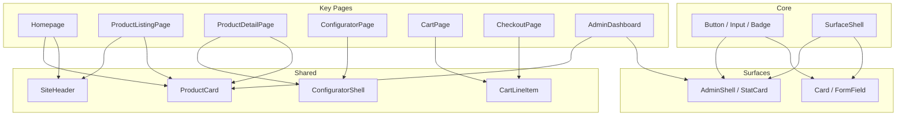

# Rehil Gallery — Component Library & Per-Page Trees

> **Task 2 deliverable.** Components grouped by architecture layer first, then shared library, then per page.  
> Naming: `PascalCase` components; `(shared)` = reused across pages.  
> **Code location:** `app/_components/` · **Showcase:** `/design-system` · **Admin preview:** `/admin`

---

## Component Architecture

Headless **core** primitives + **themed surfaces** (store vs dashboard) + **shared** domain/layout blocks + **exclusive** page-only UI.

```
app/_components/
├── core/                         # Surface-agnostic primitives & config
│   ├── primitive/                # Button, Input, Badge, Heading, …
│   ├── config/                   # variants.ts, tokens.ts, navigation.ts
│   ├── surface.tsx               # SurfaceShell → sets data-surface
│   └── types.ts
├── surfaces/
│   ├── store/abstract/           # Luxury storefront composites
│   └── dashboard/
│       ├── abstract/             # DashboardCard, StatCard, …
│       └── layout/               # AdminShell, AdminSidebar, AdminTopBar
├── shared/
│   ├── layout/                   # SiteHeader, SiteFooter, Container, …
│   └── inclusive/                # ProductCard, PriceDisplay, StatusBadge, …
└── exclusive/                    # Page-unique components (empty until needed)
```

### Dual themes (CSS)

Themes live in `app/styles/themes/` and activate via `data-surface` on each route layout:

| Surface | Route group | Visual direction | Key tokens |
|---------|-------------|------------------|------------|
| `store` | `app/(store)/` | Modern bold **luxury** — gold accent, Playfair display, generous spacing | `--accent` gold, `--font-display` Playfair |
| `dashboard` | `app/admin/` | **Modern operational** UI — indigo primary, zinc palette, compact controls, dark sidebar | `--primary` indigo, `--sidebar-*`, Geist sans |

```tsx
// Storefront layout — app/(store)/layout.tsx
<SurfaceShell surface="store">{children}</SurfaceShell>

// Admin layout — app/admin/layout.tsx
<SurfaceShell surface="dashboard">{children}</SurfaceShell>
```

Account and checkout pages will use the **store** surface (customer-facing). Staff admin uses **dashboard** only.

### Import patterns

```tsx
// Primitives (any surface)
import { Button, Heading, Input } from "@/_components/core";

// Store composites
import { Card, FormField, OtpInput } from "@/_components/surfaces/store";

// Admin UI
import { AdminShell, StatCard } from "@/_components/surfaces/dashboard";

// Cross-cutting domain + storefront chrome
import { ProductCard, SiteHeader } from "@/_components/shared";

// Barrel (re-exports all layers)
import { Button, Card, AdminShell } from "@/_components";
```

### Layer assignment rules

| Layer | Use when | Examples |
|-------|----------|----------|
| **core/primitive** | Single-purpose, token-driven, no surface-specific layout | `Button`, `Input`, `Badge` |
| **surfaces/store/abstract** | Store-themed composites built from core | `Card`, `FormField`, `EmptyState` |
| **surfaces/dashboard/** | Admin-only layout and data UI | `DashboardCard`, `AdminShell` |
| **shared/inclusive** | Domain blocks used on storefront **or** both surfaces | `ProductCard`, `StatusBadge` |
| **shared/layout** | Storefront chrome (not used in admin shell) | `SiteHeader`, `SiteFooter` |
| **exclusive/** | One-off page sections with no reuse | Campaign hero, unique landing block |

---

## Implementation Status (Design System Phase)

| Component | Layer | Path | Status |
|-----------|-------|------|--------|
| `SurfaceShell` | core | `core/surface.tsx` | ✅ |
| `Button`, `Input`, `Textarea`, `Select`, `Label` | core | `core/primitive/` | ✅ |
| `Badge`, `Heading`, `Text`, `Eyebrow`, `FilterChip` | core | `core/primitive/` | ✅ |
| `Skeleton`, `ProductCardSkeleton`, `TextSkeleton` | core | `core/primitive/skeleton.tsx` | ✅ |
| `Card`, `FormField`, `SectionTitle`, `EmptyState` | store | `surfaces/store/abstract/` | ✅ |
| `PhoneInput`, `OtpInput` | store | `surfaces/store/abstract/` | ✅ |
| `DashboardCard`, `StatCard`, `DashboardSectionTitle` | dashboard | `surfaces/dashboard/abstract/` | ✅ |
| `ActionQueue`, `DashboardOrdersTable`, `LowStockList`, `ProductionQueue`, `DashboardQuickActions` | dashboard | `surfaces/dashboard/abstract/` | ✅ |
| Analytics views (`KpiGrid`, `FunnelChart`, `MetricBarList`, …) | dashboard | `surfaces/dashboard/analytics/` | ✅ (mock data) |
| `AdminShell`, `AdminSidebar`, `AdminTopBar` | dashboard | `surfaces/dashboard/layout/` | ✅ |
| `SiteHeader`, `SiteFooter`, `Container`, `Section` | shared/layout | `shared/layout/` | ✅ |
| `LocaleSwitcher`, `MobileNavDrawer` | shared/layout | `shared/layout/` | ✅ |
| `ProductCard`, `ProductGrid`, `PriceDisplay` | shared/inclusive | `shared/inclusive/` | ✅ |
| `AvailabilityBadge`, `StatusBadge`, `RatingStars` | shared/inclusive | `shared/inclusive/` | ✅ |
| All other components below | — | — | 📋 Planned |

---

## Shared Component Library

> **Layer** column: where the component lives when implemented (`core`, `store`, `dashboard`, `shared`).

### Layout & Navigation

| Component | Layer | Description |
|-----------|-------|-------------|
| `(shared) SiteHeader` | shared/layout | Logo, primary nav, search, locale switcher, wishlist/cart/account icons |
| `(shared) SiteFooter` | shared/layout | Links, newsletter ⚠️, social, legal, contact summary |
| `(shared) LocaleSwitcher` | shared/layout | FA / EN toggle with path preservation |
| `(shared) MobileNavDrawer` | shared/layout | Hamburger menu for mobile |
| `(shared) Breadcrumbs` | store or exclusive | Category / product trail |
| `(shared) AccountSidebar` | store | Account section nav (store surface) |
| `(shared) AdminSidebar` | dashboard | Role-filtered admin nav — part of `AdminShell` |
| `(shared) AdminTopBar` | dashboard | Page title, staff user, logout, quick search |
| `(shared) AdminShell` | dashboard | Sidebar + top bar + main content wrapper |
| `(shared) Container`, `Section` | shared/layout | Max-width wrapper and vertical section spacing |

### Product & Catalog

> Planned components — implement under `shared/inclusive/` unless page-specific.

| Component | Description |
|-----------|-------------|
| `(shared) ProductCard` | Image, title, price-from, availability badge |
| `(shared) ProductGrid` | Responsive grid of ProductCard |
| `(shared) ProductGallery` | Main image + thumbnails, zoom optional |
| `(shared) PriceDisplay` | Locale-formatted IRR with LTR numbers in RTL |
| `(shared) AvailabilityBadge` | In stock / made-to-order / out of stock |
| `(shared) RatingStars` | Average + count display |
| `(shared) FilterPanel` | Category, metal, stone, price range, availability |
| `(shared) FilterChips` | Active filter pills with remove |
| `(shared) SortDropdown` | Newest, price, popular |
| `(shared) Pagination` | Page numbers or load more |
| `(shared) CollectionHero` | Editorial header for collections |

### Configurator

| Component | Description |
|-----------|-------------|
| `(shared) ConfiguratorShell` | Layout wrapper: preview + options panel |
| `(shared) OptionGroup` | Label + option buttons/swatches |
| `(shared) MetalSwatch` | Gold/white/rose/platinum selectors |
| `(shared) StoneSelector` | Stone type, cut, carat stepped UI |
| `(shared) SizeSelector` | Ring size / chain length with guide link |
| `(shared) ConfigSummary` | Live price, lead time, selection recap |
| `(shared) ConfigPreview` | Product visual preview (static or rendered) |
| `(shared) EngravingInput` | Optional text + char count |

### Cart & Checkout

| Component | Description |
|-----------|-------------|
| `(shared) CartLineItem` | Image, title, config summary, qty, price, remove |
| `(shared) OrderSummary` | Subtotal, shipping, total |
| `(shared) AddressCard` | Selectable saved address |
| `(shared) AddressForm` | Iran domestic address fields |
| `(shared) ShippingMethodSelector` | Radio list of methods |
| `(shared) PaymentGatewaySelector` | Zarinpal / IDPay / Zibal cards |
| `(shared) LeadTimeNotice` | Made-to-order acknowledgment |

### Auth & Forms

| Component | Layer | Description |
|-----------|-------|-------------|
| `(shared) PhoneInput` | store | +98 format, LTR in RTL context |
| `(shared) OtpInput` | store | 6-digit code entry with resend timer |
| `(shared) FormField` | store | Label, input, error message |
| `(shared) Button` | core | Primary, secondary, ghost variants — token-driven per surface |
| `(shared) Input`, `Textarea`, `Select`, `Label` | core | Form controls |
| `(shared) Modal` | core or store | Dialog overlay |
| `(shared) Toast` | core or store | Success/error notifications |

### Content & Misc

| Component | Layer | Description |
|-----------|-------|-------------|
| `(shared) BlogCard` | shared/inclusive | Featured image, title, excerpt, date |
| `(shared) RichTextContent` | shared or exclusive | Rendered CMS/blog HTML |
| `(shared) EmptyState` | store | Illustration + message + CTA |
| `(shared) SectionTitle` | store | Eyebrow + heading block for storefront sections |
| `(shared) LoadingSkeleton` | core | PLP, PDP, cart placeholders |
| `(shared) ErrorBoundary` | exclusive or shared | Friendly error with retry |
| `(shared) SEOHead` | — | Metadata helper (or Next.js metadata export) |

### Admin Shared

| Component | Layer | Description |
|-----------|-------|-------------|
| `(shared) DashboardCard` | dashboard | White card container for admin panels |
| `(shared) StatCard` | dashboard | KPI metric with label, value, trend |
| `(shared) DashboardSectionTitle` | dashboard | Page section heading + subtitle |
| `(shared) DataTable` | dashboard | Sortable, filterable admin table |
| `(shared) StatusBadge` | shared/inclusive | Order/return/review status colors (works on both surfaces) |
| `(shared) ConfirmDialog` | dashboard | Destructive action confirmation |
| `(shared) MediaUploader` | dashboard | Drag-drop image upload |
| `(shared) BilingualFieldGroup` | dashboard | FA + EN side-by-side inputs |
| `(shared) RoleGuard` | — | Conditional render by permission (route or component) |

---

## Per-Page Component Trees

### S-01 Homepage

```
HomePage
├── SiteHeader
├── HeroSection
│   ├── HeroImage / HeroVideo
│   ├── HeroHeadline
│   └── HeroCTA → CollectionPage
├── FeaturedCollections
│   └── CollectionCard × 3
├── NewArrivals
│   ├── SectionHeading
│   └── ProductGrid → ProductCard × 8
├── EditorialBlock
│   ├── QuoteOrStory
│   └── LinkToCraftPage
├── JournalTeaser
│   ├── SectionHeading
│   └── BlogCard × 3
└── SiteFooter
```

---

### S-02 Shop PLP / S-03 Category PLP / S-07 Search

```
ProductListingPage
├── SiteHeader
├── PageHeader
│   ├── Title
│   └── ResultCount
├── ListingLayout
│   ├── FilterPanel (desktop sidebar / mobile drawer)
│   ├── ListingToolbar
│   │   ├── FilterChips
│   │   └── SortDropdown
│   ├── ProductGrid
│   └── Pagination
├── EmptyState (if no results)
└── SiteFooter
```

**Search variant adds:** `SearchInput` in header with `?q=` sync.

---

### S-04 Collection Page

```
CollectionPage
├── SiteHeader
├── CollectionHero
├── CollectionDescription (RichTextContent)
├── ProductGrid
├── Pagination
└── SiteFooter
```

---

### S-05 Product Detail Page (PDP)

```
ProductDetailPage
├── SiteHeader
├── Breadcrumbs
├── ProductDetailLayout
│   ├── ProductGallery
│   └── ProductInfo
│       ├── ProductTitle
│       ├── PriceDisplay
│       ├── AvailabilityBadge
│       ├── RatingStars → ReviewsSection anchor
│       ├── VariantSelectors (if not fully configurable)
│       │   ├── MetalSwatch
│       │   └── SizeSelector
│       ├── ConfiguratorCTA → ConfiguratorPage (if configurable)
│       ├── AddToCartButton
│       ├── AddToWishlistButton
│       ├── LeadTimeNotice
│       └── ProductDescription (tabs: Details, Materials, Care)
├── ReviewsSection
│   ├── ReviewSummary
│   ├── ReviewList → ReviewCard × n
│   └── Pagination
├── RelatedProducts
│   └── ProductGrid
└── SiteFooter
```

---

### S-06 Configurator

```
ConfiguratorPage
├── SiteHeader
├── Breadcrumbs
├── ConfiguratorShell
│   ├── ConfigPreview
│   ├── OptionStepper (progress indicator)
│   ├── OptionGroup × n
│   │   ├── MetalSwatch
│   │   ├── StoneSelector
│   │   ├── SizeSelector
│   │   └── EngravingInput
│   └── ConfigSummary
│       ├── PriceDisplay (live)
│       ├── LeadTimeNotice
│       ├── AddToCartButton
│       └── SaveToWishlistButton
├── SizeGuideLink
└── SiteFooter
```

---

### S-08 Blog Index

```
BlogIndexPage
├── SiteHeader
├── PageHeader
├── TagFilter (optional)
├── BlogGrid → BlogCard × n
├── Pagination
└── SiteFooter
```

---

### S-09 Blog Post

```
BlogPostPage
├── SiteHeader
├── ArticleHeader (title, date, hero image)
├── RichTextContent
├── ShareLinks (optional)
├── RelatedPosts → BlogCard × 3
└── SiteFooter
```

---

### S-10 About / S-11 Craft / S-12 Contact / S-13 Size Guide / S-14 Legal

```
StaticContentPage (template)
├── SiteHeader
├── PageHero (title + optional image)
├── ContentSections × n
│   ├── TextBlock
│   ├── ImageBlock
│   └── TwoColumnBlock
└── SiteFooter
```

**Contact adds:** `ContactForm`, `MapEmbed`, `ContactInfo`

**Size Guide adds:** `SizeChartTable`, `MeasurementInstructions`

---

### A-01 Login / A-02 Register

```
AuthPage
├── SiteHeader (minimal)
├── AuthCard
│   ├── AuthTitle
│   ├── PhoneInput
│   ├── OtpInput (step 2)
│   ├── SubmitButton
│   ├── ResendOtpLink (with countdown)
│   └── RedirectNotice
└── SiteFooter (minimal)
```

---

### C-01 Account Overview

```
AccountOverviewPage
├── SiteHeader
├── AccountLayout
│   ├── AccountSidebar
│   └── AccountDashboard
│       ├── ProfileSummaryCard
│       ├── RecentOrdersList → OrderSummaryCard × 3
│       └── QuickLinks (wishlist, addresses)
└── SiteFooter
```

---

### C-02 Edit Profile

```
ProfileEditPage
├── SiteHeader
├── AccountLayout
│   ├── AccountSidebar
│   └── ProfileForm
│       ├── FormField (name, email)
│       ├── SizeSelector (default ring size)
│       ├── LocaleSwitcher
│       └── SaveButton
└── SiteFooter
```

---

### C-03 Addresses

```
AddressesPage
├── SiteHeader
├── AccountLayout
│   ├── AccountSidebar
│   └── AddressList
│       ├── AddressCard × n
│       ├── AddAddressButton
│       └── AddressForm (modal or inline)
└── SiteFooter
```

---

### C-04 Orders List

```
OrdersListPage
├── SiteHeader
├── AccountLayout
│   ├── AccountSidebar
│   └── OrdersTable / OrderList
│       └── OrderSummaryCard × n
│           ├── OrderNumber
│           ├── StatusBadge
│           ├── Date
│           ├── Total
│           └── ViewDetailLink
└── SiteFooter
```

---

### C-05 Order Detail

```
OrderDetailPage
├── SiteHeader
├── AccountLayout
│   ├── AccountSidebar
│   └── OrderDetail
│       ├── OrderHeader (number, date, status)
│       ├── OrderTimeline (simplified steps)
│       ├── CartLineItem × n (read-only)
│       ├── ShippingAddress
│       ├── TrackingInfo (if shipped)
│       ├── OrderSummary
│       └── ActionButtons
│           ├── RequestReturnButton (if eligible)
│           └── WriteReviewButton (if eligible)
└── SiteFooter
```

---

### C-06 Wishlist

```
WishlistPage
├── SiteHeader
├── AccountLayout
│   ├── AccountSidebar
│   └── WishlistGrid
│       └── WishlistItem × n
│           ├── ProductCard or ConfigSummary
│           ├── AddToCartButton
│           └── RemoveButton
├── EmptyState
└── SiteFooter
```

---

### C-07 Returns List / C-08 Return Request

```
ReturnsListPage
├── AccountLayout → ReturnRequestCard × n

ReturnRequestPage
├── AccountLayout
└── ReturnForm
    ├── OrderLineSelector (checkboxes)
    ├── ReasonSelector
    ├── CommentTextarea
    ├── PhotoUploader (optional)
    └── SubmitButton
```

---

### C-09 Write Review

```
WriteReviewPage
├── AccountLayout
└── ReviewForm
    ├── ProductMiniCard
    ├── RatingStars (interactive)
    ├── FormField (title, body)
    ├── PhotoUploader
    └── SubmitButton
```

---

### K-01 Cart

```
CartPage
├── SiteHeader
├── PageHeader
├── CartContent
│   ├── CartLineItem × n
│   ├── LeadTimeNotice (mixed cart)
│   └── OrderSummary
│       ├── ContinueShoppingLink
│       └── CheckoutButton
├── EmptyState
└── SiteFooter
```

---

### K-02 Checkout

```
CheckoutPage
├── SiteHeader (minimal)
├── CheckoutSteps (indicator: Address → Shipping → Payment)
├── CheckoutLayout
│   ├── CheckoutMain
│   │   ├── AddressSection
│   │   │   ├── AddressCard × n
│   │   │   └── AddressForm
│   │   ├── ShippingMethodSelector
│   │   ├── PaymentGatewaySelector
│   │   └── MadeToOrderAcknowledgment (checkbox)
│   └── CheckoutSidebar
│       └── OrderSummary
│           └── PlaceOrderButton
└── SiteFooter (minimal)
```

---

### K-03 Payment Success / K-04 Payment Failed

```
PaymentResultPage
├── SiteHeader (minimal)
├── ResultCard
│   ├── StatusIcon (success / error)
│   ├── Headline
│   ├── OrderNumber
│   ├── SummaryOrErrorMessage
│   └── CTAButtons (view order / retry / home)
└── SiteFooter (minimal)
```

---

## Admin Page Component Trees

### AD-02 Dashboard

```
AdminDashboardPage
├── AdminShell
│   ├── AdminSidebar
│   ├── AdminTopBar
│   └── main
├── DashboardSectionTitle
├── StatCard × 4 (revenue, orders, production, low stock)
├── DashboardCard — Recent orders table
└── DashboardCard — Quick actions
```

**Preview route:** `/admin` (mock data, dashboard surface)

---

### AD-19 Analytics Dashboards

```
AnalyticsLayout
├── AdminShell
├── AnalyticsTabNav
└── View (one of)
    ├── ExecutiveAnalyticsView — KpiGrid + RankedList (top products)
    ├── MarketingAnalyticsView — channel mix, CAC, campaigns
    ├── ProductAnalyticsView — SKU rankings, inventory status
    ├── CustomerAnalyticsView — cohorts, first-purchase categories
    └── FunnelAnalyticsView — FunnelChart, device & checkout breakdown
```

**Routes:** `/admin/analytics`, `/admin/analytics/marketing`, `/product`, `/customer`, `/funnel`  
**Metric definitions:** [kpi-analytics.md](./kpi-analytics.md)

---

### AD-03 Products List

```
AdminProductsPage
├── AdminShell
└── ProductsContent
    ├── PageActions (search, filter, add new)
    ├── DataTable (products)
    └── Pagination
```

---

### AD-04 Product Edit

```
AdminProductEditPage
├── AdminShell
└── ProductForm
    ├── BilingualFieldGroup (title, description)
    ├── CategorySelect
    ├── CollectionMultiSelect
    ├── MediaUploader
    ├── FulfillmentModeToggle
    ├── VariantManager
    ├── ConfigurableToggle
    ├── PublishControls
    └── SaveButton
```

---

### AD-05–06 Collections

```
AdminCollectionsPage → DataTable
AdminCollectionEditPage → BilingualFieldGroup, MediaUploader, ProductPicker
```

---

### AD-07 Configurator Options

```
AdminConfiguratorPage
├── CategoryTabs
└── OptionSetEditor
    ├── OptionGroupEditor × n
    └── CompatibilityRulesEditor
```

---

### AD-08 Inventory

```
AdminInventoryPage
└── DataTable (SKU, product, qty, low stock flag) + inline qty edit
```

---

### AD-09–10 Orders

```
AdminOrdersPage → DataTable with status filters
AdminOrderDetailPage
├── OrderHeader
├── CustomerInfo
├── LineItemsTable (with config JSON view)
├── StatusUpdateForm
├── TrackingForm
└── InternalNotes
```

---

### AD-11–12 Returns

```
AdminReturnsPage → DataTable
AdminReturnDetailPage
├── ReturnItemsList
├── CustomerPhotos
├── ApproveRejectActions
└── RefundTrigger
```

---

### AD-13 Reviews Moderation

```
AdminReviewsPage
└── DataTable with approve/reject actions + preview modal
```

---

### AD-14–15 Blog

```
AdminBlogPage → DataTable
AdminBlogEditPage → BilingualFieldGroup, RichTextEditor, MediaUploader, PublishControls
```

---

### AD-16 Homepage Blocks

```
AdminHomepagePage
└── BlockList (reorderable)
    └── BlockEditor × type (hero, collection, editorial)
```

---

### AD-17 Users & Roles

```
AdminUsersPage
└── DataTable + UserForm (phone, name, role multi-select)
```

---

### AD-18 Settings

```
AdminSettingsPage
└── SettingsTabs
    ├── ShippingSettingsForm
    ├── ReturnsPolicyForm
    ├── PaymentGatewaysToggle
    └── GeneralSettingsForm
```

---

## Component Dependency Graph (High Level)



---

## Implementation Notes

1. **Surfaces & themes:** Never hardcode store vs admin colors in components. Use semantic tokens (`bg-primary`, `text-ink-muted`, `bg-sidebar-bg`) so `data-surface` switches the theme. Primitives in `core/` must work on both surfaces.
2. **Server vs Client:** Product grids, blog, static pages → Server Components. Configurator, cart, checkout, OTP, admin forms → Client Components. `AdminShell` is a Client Component (pathname-aware sidebar).
3. **i18n:** All user-facing strings via `next-intl` or equivalent; no hardcoded FA/EN in components.
4. **RTL:** Use logical CSS properties; `PriceDisplay` and `PhoneInput` always LTR.
5. **Admin:** Wrap routes with `RoleGuard`; hide sidebar items user cannot access. Admin pages compose inside `AdminShell` — do not reuse `SiteHeader` / `SiteFooter`.
6. **Cards:** Storefront uses `Card` (`surfaces/store`); admin uses `DashboardCard` (`surfaces/dashboard`). Do not cross-use.
7. **Design system page:** `/design-system` renders under the store surface with a nested `data-surface="dashboard"` preview block for the admin theme.

---

*See [figma-briefs.md](./figma-briefs.md) for visual layout specifications per page.*
