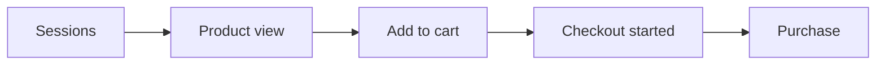
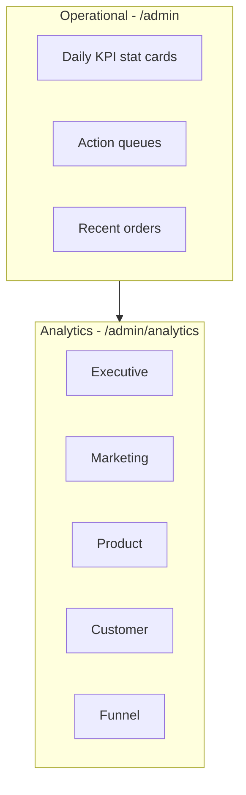

# Rehil Gallery — KPI & Analytics

> **Scope:** Metric definitions, admin analytics dashboards, data sources, and frontend implementation.  
> **Status:** UI implemented with mock data at `/admin/analytics/*`. Backend analytics API ⚠️ assumed until contract is confirmed.  
> **Related:** [pages.md](./pages.md) · [business-logic.md](./business-logic.md) · [api-assumptions.md](./api-assumptions.md) · [components.md](./components.md)

---

## Table of Contents

1. [Overview](#1-overview)
2. [Operational vs Analytics Dashboards](#2-operational-vs-analytics-dashboards)
3. [Core Business KPIs](#3-core-business-kpis)
4. [Product Performance KPIs](#4-product-performance-kpis)
5. [Marketing & Acquisition KPIs](#5-marketing--acquisition-kpis)
6. [Customer Behavior KPIs](#6-customer-behavior-kpis)
7. [Funnel Metrics](#7-funnel-metrics)
8. [Dashboard Structure](#8-dashboard-structure)
9. [Routes & Access Control](#9-routes--access-control)
10. [Data Sources & Event Tracking](#10-data-sources--event-tracking)
11. [Frontend Implementation](#11-frontend-implementation)
12. [API Assumptions](#12-api-assumptions)
13. [Open Decisions](#13-open-decisions)
14. [KPI Benchmarks & Targets](#14-kpi-benchmarks--targets)
15. [Period Selector & Comparison Rules](#15-period-selector--comparison-rules)
16. [KPI Definition Tooltips](#16-kpi-definition-tooltips)
17. [Implementation Status Matrix](#17-implementation-status-matrix)

---

## 1. Overview

Rehil Gallery admin exposes **two complementary dashboard layers**:

| Layer | Route | Audience | Purpose |
|-------|-------|----------|---------|
| **Operational dashboard** | `/admin` | All staff roles | Day-to-day queues — orders to confirm, returns, reviews, low stock, production due |
| **Analytics dashboards** | `/admin/analytics/*` | **Admin only** ⚠️ | Business intelligence — revenue, conversion, channels, SKU performance, cohorts, funnel |

Analytics answers *“How is the business performing?”* Operational dashboard answers *“What needs action right now?”*

Currency for all revenue metrics: **IRR (Toman)**. Percentages use **percentage points (pp)** for period-over-period comparison where noted.

---

## 2. Operational vs Analytics Dashboards

### Operational dashboard (`/admin`)

**Roles:** Admin, Catalog, Fulfillment, Content (role-filtered widgets planned).

| Widget | Metric / queue | Links to |
|--------|----------------|----------|
| Stat cards | Revenue today, new orders, pending returns, reviews to moderate, in production, low stock | Orders, returns, reviews, inventory |
| Needs attention | Paid orders to confirm, return queue, review moderation, restock alerts | Detail routes |
| Recent orders | Last N orders with status | `/admin/orders/[id]` |
| Quick actions | Add product, review returns, analytics, etc. | Admin CRUD routes |
| Low stock alerts | SKUs ≤ threshold | `/admin/inventory` |
| Production due soon | Made-to-order milestones | `/admin/orders/[id]` |

### Analytics dashboards (`/admin/analytics/*`)

**Roles:** Admin only (per [business-logic.md § 8.2](./business-logic.md#82-permission-matrix)).

Five tabbed views: **Executive**, **Marketing**, **Product**, **Customer**, **Funnel**.

Default period: **last 30 days** (`30d`). The admin UI includes a **period selector** (7d / 30d / 90d) synced to the `?period=` query param. Volume metrics scale with the window; rate metrics shift slightly to simulate period variance until the backend API is live.

---

## 3. Core Business KPIs

These metrics define overall business health. Primary home: **Executive** dashboard.

| KPI | Definition | Formula |
|-----|------------|---------|
| **Net revenue** | Total revenue after discounts, returns, and cancellations | `gross_revenue − discounts − returns − cancelled_order_value` |
| **Orders** | Count of completed purchases in period | `COUNT(orders WHERE status NOT IN (pending_payment, cancelled))` |
| **Conversion rate (CR)** | Share of sessions that become orders | `orders ÷ sessions × 100` |
| **Average order value (AOV)** | Mean revenue per order | `net_revenue ÷ orders` |
| **Customer acquisition cost (CAC)** | Cost to acquire one new customer | `marketing_spend ÷ new_customers` |
| **Lifetime value (LTV)** | Expected total revenue per customer | ⚠️ Model-dependent — typically `AOV × purchase_frequency × customer_lifespan` or cohort-based |
| **LTV:CAC ratio** | Acquisition efficiency | `LTV ÷ CAC` — **target > 3×** |
| **Gross margin %** | Profitability before operating expenses | `(revenue − COGS) ÷ revenue × 100` |
| **Return rate** | Share of orders returned | `returned_orders ÷ delivered_orders × 100` |
| **ROAS (blended)** | Return on ad spend across paid channels | `attributed_revenue_from_ads ÷ ad_spend` |

### Executive dashboard also shows

- **Top products by revenue** — SKU ranked list with revenue share %
- Period comparison deltas (e.g. `+8.4% vs prior 30d`)

---

## 4. Product Performance KPIs

Essential for catalog optimization in jewelry. Primary home: **Product** dashboard.

| KPI | Definition | Formula |
|-----|------------|---------|
| **Product view → add-to-cart rate** | PDP engagement | `add_to_cart_events ÷ product_view_events × 100` |
| **Add-to-cart → purchase rate** | Cart effectiveness | `purchases ÷ add_to_cart_events × 100` |
| **SKU revenue contribution** | Share of total revenue by SKU | `sku_revenue ÷ total_revenue × 100` |
| **SKU profit margin contribution** | Gross margin % by SKU | `(sku_revenue − sku_COGS) ÷ sku_revenue × 100` |
| **Inventory turnover rate** | How fast stock sells | `COGS ÷ average_inventory` (annualized for jewelry: typical range 3–5×) |
| **Stockout rate** | Exposure to unavailable SKUs | `stockout_sku_days ÷ (total_skus × days) × 100` ⚠️ exact definition TBD |

### Product dashboard also shows

- Ranked **SKU revenue** and **SKU margin** lists
- **Inventory status** breakdown: in stock, made-to-order only, out of stock, low stock (≤ 3 units — see OD-08 in business-logic)

### Jewelry-specific notes

- **Configurator / custom SKUs** often have higher margin but lower volume — track separately from ready-to-ship.
- **Made-to-order** items may show zero inventory turnover until fulfillment model is reflected in COGS timing ⚠️.
- **Sets and bridal bundles** should support bundle-level and component-level attribution ⚠️.

---

## 5. Marketing & Acquisition KPIs

Evaluates channel effectiveness. Primary home: **Marketing** dashboard.

| KPI | Definition | Formula |
|-----|------------|---------|
| **Channel revenue mix** | Revenue share by acquisition channel | Per-channel `channel_revenue ÷ total_revenue × 100` |
| **ROAS** | Return on ad spend | `channel_revenue ÷ channel_ad_spend` |
| **CAC by channel** | Acquisition cost per channel | `channel_spend ÷ channel_new_customers` |
| **Email revenue share** | Revenue attributed to email | `email_attributed_revenue ÷ total_revenue × 100` |
| **Influencer conversion efficiency** | Influencer campaign performance | `influencer_orders ÷ influencer_sessions × 100` |
| **Campaign CTR** | Click-through rate | `clicks ÷ impressions × 100` |
| **Campaign conversion rate** | Sessions to purchase from campaign | `campaign_orders ÷ campaign_sessions × 100` |

### Channels (v1 taxonomy)

| Channel | Examples |
|---------|----------|
| Organic search | SEO, direct product discovery |
| Paid search | Google Ads |
| Social (paid) | Meta, TikTok ads |
| Email | Newsletters, abandoned cart, post-purchase |
| Influencers | Creator partnerships |
| Direct / other | Typed URL, unattributed |

### Marketing dashboard also shows

- **Channel revenue mix** bar chart
- **CAC by channel** comparison
- **Influencer efficiency** summary grid
- **Campaign performance** table: spend, revenue, ROAS, CTR, conversion

---

## 6. Customer Behavior KPIs

Important for lifecycle-driven purchases (gifts, occasions, bridal). Primary home: **Customer** dashboard.

| KPI | Definition | Formula |
|-----|------------|---------|
| **LTV** | Same as core business KPI | See § 3 |
| **Repeat purchase rate** | Customers who buy again | `customers_with_2+_orders ÷ total_customers × 100` |
| **Time between purchases** | Average days between orders | `AVG(days_between_consecutive_orders)` per customer |
| **Wishlist rate** | Engagement with save-for-later | `sessions_with_wishlist_add ÷ sessions × 100` |
| **Cart abandonment rate** | Carts not converted | `(carts_created − orders) ÷ carts_created × 100` |
| **First purchase category distribution** | Entry category for new buyers | `new_customers_by_category ÷ new_customers × 100` |

### Customer dashboard also shows

- **First purchase category** bar breakdown (rings, necklaces, earrings, sets, bracelets, custom)
- **Cohort table** — monthly acquisition cohorts with repeat rate and average LTV

### Jewelry-specific notes

- **Rings / engagement** typically dominate first purchase; **repeat** often skews toward earrings, gifts, anniversaries.
- **Seasonality:** Nowruz, Valentine's, wedding season — cohort views should support calendar overlays ⚠️ v1.1.

---

## 7. Funnel Metrics

Standard ecommerce funnel tracking. Primary home: **Funnel** dashboard.

### Funnel stages



| Stage | Definition |
|-------|------------|
| **Session** | Unique visit with storefront activity |
| **Product view** | At least one PDP viewed |
| **Add to cart** | Line item added (includes configurator) |
| **Checkout started** | Checkout page entered with non-empty cart |
| **Purchase** | Payment confirmed (`paid` or later) |

### Key derived metrics

| KPI | Formula |
|-----|---------|
| **Product view rate** | `product_view_sessions ÷ sessions × 100` |
| **Cart conversion rate** | `add_to_cart ÷ product_views × 100` |
| **Checkout drop-off rate** | `(checkout_started − purchases) ÷ checkout_started × 100` |
| **Overall conversion rate** | `purchases ÷ sessions × 100` |
| **Payment failure rate** | `failed_payment_attempts ÷ payment_attempts × 100` |

### Funnel dashboard also shows

- **Visual funnel** with step counts, conversion from previous step, and drop-off %
- **Device breakdown** — mobile / desktop / tablet share and CR by device
- **Checkout drop-off by step** — address, shipping, payment gateway, order review
- **Payment failure breakdown** — insufficient funds, gateway timeout, user cancelled, bank decline

---

## 8. Dashboard Structure



| Dashboard | Route | Primary KPIs |
|-----------|-------|--------------|
| **Executive** | `/admin/analytics` | Net revenue, orders, CR, AOV, CAC, LTV, LTV:CAC, gross margin, return rate, ROAS, top products |
| **Marketing** | `/admin/analytics/marketing` | Channel mix, ROAS, CAC by channel, email share, influencer efficiency, campaigns |
| **Product** | `/admin/analytics/product` | View→cart, cart→purchase, SKU revenue/margin, turnover, stockout, inventory status |
| **Customer** | `/admin/analytics/customer` | LTV, repeat rate, time between purchases, wishlist, abandonment, first-buy categories, cohorts |
| **Funnel** | `/admin/analytics/funnel` | Funnel steps, product view rate, checkout drop-off, payment failure, device breakdown |

---

## 9. Routes & Access Control

| Route | Page ID | Auth | Roles |
|-------|---------|------|-------|
| `/admin` | AD-02 | Staff | All staff |
| `/admin/analytics` | AD-19 | Staff | **Admin** |
| `/admin/analytics/marketing` | AD-19a | Staff | **Admin** |
| `/admin/analytics/product` | AD-19b | Staff | **Admin** |
| `/admin/analytics/customer` | AD-19c | Staff | **Admin** |
| `/admin/analytics/funnel` | AD-19d | Staff | **Admin** |

Non-admin roles should not see the **Analytics** sidebar item or routes (enforce via `RoleGuard` + backend 403).

---

## 10. Data Sources & Event Tracking

### Backend (authoritative)

Analytics aggregates are computed server-side from:

- Orders, returns, refunds
- Product catalog and inventory
- Customer accounts and order history
- Marketing spend and attribution ⚠️ integration TBD
- Session / event pipeline ⚠️

### Storefront events (frontend hooks)

Per [business-logic.md § 11.5](./business-logic.md#115-analytics-), the storefront will emit:

| Event | Trigger | Used for |
|-------|---------|----------|
| `view_item` | PDP view | Product views, funnel |
| `add_to_cart` | Cart add | Cart conversion, funnel |
| `begin_checkout` | Checkout entry | Checkout funnel |
| `purchase` | Payment success | Revenue, CR, AOV |

**Status:** Event implementation deferred to integration phase. Analytics UI currently uses mock data.

### Attribution rules ⚠️

- **Last-click** default for paid channels unless backend specifies multi-touch.
- **Organic vs direct** split based on referrer and UTM parameters.
- **Influencer** tagged via UTM `utm_source=influencer` or dedicated campaign codes.

---

## 11. Frontend Implementation

### Live routes

| URL | Description |
|-----|-------------|
| `/admin` | Operational dashboard |
| `/admin/analytics` | Executive analytics (default tab) |

Tab navigation switches between Executive / Marketing / Product / Customer / Funnel without full page chrome reload (separate Next.js routes).

### Code locations

```
app/admin/
├── page.tsx                          # Operational dashboard
└── analytics/
    ├── layout.tsx                    # AdminShell + AnalyticsTabNav + period provider
    ├── page.tsx                      # Executive view
    ├── marketing/page.tsx
    ├── product/page.tsx
    ├── customer/page.tsx
    └── funnel/page.tsx

app/_components/surfaces/dashboard/
├── data/
│   ├── mock-dashboard.ts             # Operational mock data
│   ├── mock-analytics.ts             # Legacy static types + reference values
│   └── analytics-data.ts             # Period + locale-aware snapshot builder
├── analytics/
│   ├── analytics-tab-nav.tsx         # Tab navigation (client)
│   ├── analytics-period-provider.tsx # URL-synced period context (?period=)
│   ├── analytics-period-selector.tsx # 7d / 30d / 90d segmented control
│   ├── use-analytics-data.ts         # Hook: period + locale → snapshot
│   ├── kpi-grid.tsx                  # StatCard grid with definition tooltips
│   ├── metric-lists.tsx              # Bar lists, ranked lists, metric grids
│   ├── funnel-chart.tsx              # Funnel visualization
│   ├── data-tables.tsx               # Campaign & cohort tables
│   └── views/                        # Per-dashboard view components
├── abstract/                         # DashboardCard, StatCard, queues, tables
└── layout/admin-shell.tsx            # Sidebar includes Analytics link

lib/analytics/
├── period.ts                         # AnalyticsPeriod type, URL parsing, volume scale
└── format.ts                         # Locale-aware currency, count, percent formatting
```

### UI components

| Component | Purpose |
|-----------|---------|
| `StatCard` | Single KPI with label, value, trend, optional link |
| `KpiGrid` | Responsive grid of stat cards |
| `MetricBarList` | Horizontal bar breakdown (channels, devices, etc.) |
| `RankedList` | Numbered SKU / product ranking |
| `FunnelChart` | Step funnel with conversion and drop-off |
| `CampaignTable` | Marketing campaign rows |
| `CohortTable` | Monthly cohort repeat / LTV |

**Theme:** Dashboard surface — `data-surface="dashboard"`, see `app/styles/themes/dashboard.css`.

### Period selector (implemented)

- UI: `AnalyticsPeriodSelector` in the analytics layout, above tab content.
- State: `AnalyticsPeriodProvider` reads/writes `?period=7d|30d|90d` (default `30d` omits the param).
- Data: `getAnalyticsSnapshot(period, locale)` in `analytics-data.ts` scales volume metrics and formats values per locale.
- All five views consume `useAnalyticsData()` instead of static `mock-analytics.ts` imports.

### KPI definition tooltips (implemented)

Each `StatCard` in analytics KPI grids shows an **(i)** hint icon. Definitions live in i18n:

- `analytics.definitions.executive.*`
- `analytics.definitions.marketing.*`
- `analytics.definitions.product.*`
- `analytics.definitions.customer.*`
- `analytics.definitions.funnel.*`

Hover/focus reveals the formula-oriented description from [§3–7](#3-core-business-kpis).

### Replacing mock data

1. Add API client functions under `lib/api/admin/analytics.ts` ⚠️ (not yet created).
2. Swap `getAnalyticsSnapshot()` internals to call the API; keep the same return shape.
3. Pass `period` query param (`7d` | `30d` | `90d`) to API (already wired in URL).
4. Add loading skeletons (`Skeleton` from core) and error states.

---

## 12. API Assumptions

⚠️ Placeholder until backend confirms. See [api-assumptions.md](./api-assumptions.md).

### GET `/admin/analytics/overview`

Query: `?period=30d`

Response (executive summary):

```json
{
  "period": "30d",
  "kpis": {
    "netRevenue": 1200000000,
    "orders": 342,
    "conversionRate": 2.8,
    "aov": 3500000,
    "cac": 480000,
    "ltv": 8200000,
    "ltvCacRatio": 17.1,
    "grossMarginPercent": 62.4,
    "returnRate": 3.2,
    "roas": 4.6
  },
  "comparison": {
    "netRevenueChangePercent": 8.4,
    "ordersChangePercent": 12
  },
  "topProducts": [
    { "sku": "RNG-SOL-1CT", "name": "...", "revenue": 185000000, "sharePercent": 18.2 }
  ]
}
```

### GET `/admin/analytics/marketing`

Channel mix, CAC by channel, campaigns list.

### GET `/admin/analytics/product`

SKU rankings, conversion rates, inventory metrics.

### GET `/admin/analytics/customer`

LTV, repeat rate, category distribution, cohorts.

### GET `/admin/analytics/funnel`

Funnel steps, device breakdown, checkout drop-offs, payment failures.

All endpoints require staff JWT and **Admin** role.

---

## 13. Open Decisions

| ID | Topic | Current assumption | Owner |
|----|-------|-------------------|-------|
| AN-01 | Analytics API contract | Assumed REST paths above | Backend |
| AN-02 | LTV calculation model | Cohort-based average | Business / Data |
| AN-03 | COGS source | Backend per-SKU cost field | Backend |
| AN-04 | Marketing attribution | Last-click + UTM | Marketing |
| AN-05 | Session definition | 30-min inactivity window ⚠️ | Backend |
| AN-06 | Period comparison | Prior period of equal length | Product |
| AN-07 | Non-admin analytics access | Admin only | Business |
| AN-08 | Real-time vs batch | Daily batch OK for v1 ⚠️ | Backend |

---

## 14. KPI Benchmarks & Targets

Jewelry ecommerce reference ranges for executive review. Actual targets are business-defined; these guide dashboard coloring and alerts in a future release.

| KPI | Healthy range | Alert threshold |
|-----|---------------|-----------------|
| Conversion rate (CR) | 2–4% | < 1.5% |
| AOV (IRR) | 3–8M | < 2M |
| LTV:CAC | > 3× | < 2× |
| Gross margin % | 55–70% | < 50% |
| Return rate | < 5% | > 8% |
| ROAS (blended) | > 3× | < 2× |
| Repeat purchase rate | 25–35% | < 20% |
| Cart abandonment | 65–75% | > 80% |
| Payment failure rate | < 5% | > 8% |
| Stockout rate | < 3% | > 5% |

---

## 15. Period Selector & Comparison Rules

| Period | Window | Comparison baseline |
|--------|--------|---------------------|
| `7d` | Rolling last 7 days | Prior 7 days |
| `30d` | Rolling last 30 days (default) | Prior 30 days |
| `90d` | Rolling last 90 days | Prior 90 days |

**Volume metrics** (revenue, orders, sessions, ad spend) scale proportionally with period length in mock data.

**Rate metrics** (CR, margins, abandonment) remain comparable across periods; mock applies a small period offset (±0.4pp) for realism.

**URL persistence:** `/admin/analytics/marketing?period=90d` — period survives tab navigation within analytics.

---

## 16. KPI Definition Tooltips

Tooltip copy is bilingual (`en` / `fa`) under `analytics.definitions.*` in `en-extra.ts` / `fa-extra.ts`. Each key maps 1:1 to a KPI `id` in `KpiGrid`:

| Tab | Example key | User sees |
|-----|-------------|-----------|
| Executive | `analytics.definitions.executive.ltvCac` | "LTV divided by CAC. Target above 3×…" |
| Funnel | `analytics.definitions.funnel.overallConversion` | "Purchases divided by sessions…" |

The **Overall conversion** KPI card was added to the Funnel tab (previously only visible inside the funnel chart).

---

## 17. Implementation Status Matrix

| Capability | Frontend | Backend | Docs |
|------------|----------|---------|------|
| Five analytics tabs | ✅ | — | ✅ |
| Period selector (7d/30d/90d) | ✅ | ⚠️ API TBD | ✅ |
| Locale-aware KPI values | ✅ | — | ✅ |
| KPI definition tooltips | ✅ | — | ✅ |
| Overall conversion KPI card | ✅ | — | ✅ |
| REST analytics API | ⚠️ client stub pending | ❌ | ✅ [server doc](../../rahil-gallery-server/docs/admin-analytics-api.md) |
| Storefront event pipeline | — | ❌ | ⚠️ deferred |
| Admin-only role guard | ⚠️ auth only | ⚠️ | ✅ |
| Analyst read-only role | ❌ | ❌ | ⚠️ |

---

*Maintained as part of Rehil Gallery frontend. Update when analytics API spec and storefront event pipeline are finalized.*
