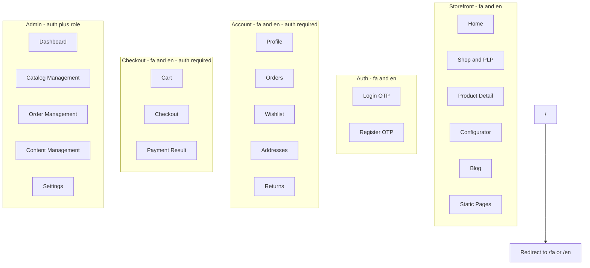

# Rahil Gallery — Page Inventory

> **Task 1 deliverable.** All customer routes are duplicated under `/fa/` and `/en/` unless noted.  
> **Admin routes** use `/admin/` with no locale prefix (bilingual UI labels).

---

## Route Architecture Overview

---

## Summary Count

| Section | Unique page types | Localized routes (×2) | Admin routes |
|---------|-------------------|----------------------|--------------|
| Storefront | 14 | 28 | — |
| Auth | 2 | 4 | — |
| Account | 6 | 12 | — |
| Checkout | 4 | 8 | — |
| Admin | — | — | **23** |
| **Total route files** | **27 types** | **52 localized** | **23 admin** |

---

## Global & Utility Routes

| Route | Purpose | Auth | Notes |
|-------|---------|------|-------|
| `/` | Locale redirect | No | Cookie / Accept-Language → `/fa` or `/en` |
| `/[locale]/404` | Not found | No | Localized |
| `/[locale]/500` | Error | No | Localized |

---

## Storefront Pages

### S-01 Homepage

| | |
|---|---|
| **Routes** | `/fa/`, `/en/` |
| **Purpose** | Brand entry, featured collections, editorial storytelling |
| **Auth** | Public |

---

### S-02 Shop / All Products (PLP)

| | |
|---|---|
| **Routes** | `/fa/shop`, `/en/shop` |
| **Purpose** | Full catalog with rich filters and sort |
| **Auth** | Public |

---

### S-03 Category PLP

| | |
|---|---|
| **Routes** | `/fa/shop/rings`, `/fa/shop/necklaces`, `/fa/shop/earrings`, `/fa/shop/bracelets`, `/fa/shop/sets`, `/fa/shop/custom` (+ `/en/` equivalents) |
| **Purpose** | Category-scoped product listing |
| **Auth** | Public |

Sub-routes (optional v1, same PLP template):
- `/fa/shop/rings/engagement`, `/fa/shop/rings/wedding`, etc.

---

### S-04 Collection Page

| | |
|---|---|
| **Routes** | `/fa/collections/[slug]`, `/en/collections/[slug]` |
| **Purpose** | Editorial collection landing + product grid |
| **Auth** | Public |

---

### S-05 Product Detail Page (PDP)

| | |
|---|---|
| **Routes** | `/fa/products/[slug]`, `/en/products/[slug]` |
| **Purpose** | Product gallery, variants, configurator entry, reviews, related items |
| **Auth** | Public (purchase requires login) |

---

### S-06 Configurator

| | |
|---|---|
| **Routes** | `/fa/custom`, `/fa/custom/[category]`, `/en/custom`, `/en/custom/[category]` |
| **Purpose** | Standalone custom jewelry builder |
| **Auth** | Public to configure; login required to add to cart |

Categories: `rings`, `necklaces`, `earrings`, `bracelets`, `sets`

---

### S-07 Search Results

| | |
|---|---|
| **Routes** | `/fa/search`, `/en/search` |
| **Purpose** | Full-text search results with filters |
| **Auth** | Public |
| **Query** | `?q=...` |

---

### S-08 Blog Index

| | |
|---|---|
| **Routes** | `/fa/journal`, `/en/journal` |
| **Purpose** | Blog listing with tags/categories |
| **Auth** | Public |

---

### S-09 Blog Post

| | |
|---|---|
| **Routes** | `/fa/journal/[slug]`, `/en/journal/[slug]` |
| **Purpose** | Single article (stories, care guides) |
| **Auth** | Public |

---

### S-10 About

| | |
|---|---|
| **Routes** | `/fa/about`, `/en/about` |
| **Purpose** | Brand story, craftsmanship, gallery heritage |
| **Auth** | Public |

---

### S-11 Craftsmanship / Process

| | |
|---|---|
| **Routes** | `/fa/craft`, `/en/craft` |
| **Purpose** | How pieces are made, materials, artisans |
| **Auth** | Public |

---

### S-12 Contact

| | |
|---|---|
| **Routes** | `/fa/contact`, `/en/contact` |
| **Purpose** | Contact form, gallery location, hours |
| **Auth** | Public |

---

### S-13 Size Guide

| | |
|---|---|
| **Routes** | `/fa/size-guide`, `/en/size-guide` |
| **Purpose** | Ring size chart, measuring instructions |
| **Auth** | Public |

---

### S-14 Legal & Policy Pages

| | |
|---|---|
| **Routes** | `/fa/privacy`, `/fa/terms`, `/fa/returns-policy`, `/fa/shipping-policy` (+ `/en/`) |
| **Purpose** | Legal and policy content |
| **Auth** | Public |

---

## Auth Pages

### A-01 Login

| | |
|---|---|
| **Routes** | `/fa/login`, `/en/login` |
| **Purpose** | Phone + OTP login |
| **Auth** | Guest only (redirect if logged in) |
| **Query** | `?redirect=/fa/checkout` |

---

### A-02 Register

| | |
|---|---|
| **Routes** | `/fa/register`, `/en/register` |
| **Purpose** | Phone + OTP registration (may merge with login flow) |
| **Auth** | Guest only |
| **Note** | Can be single `/login` page with register/login unified — list separately for clarity |

---

## Account Pages (Auth Required)

### C-01 Account Overview / Profile

| | |
|---|---|
| **Routes** | `/fa/account`, `/en/account` |
| **Purpose** | Profile summary, ring size, locale preference |
| **Auth** | Required |

---

### C-02 Edit Profile

| | |
|---|---|
| **Routes** | `/fa/account/profile`, `/en/account/profile` |
| **Purpose** | Name, email, default ring size |
| **Auth** | Required |

---

### C-03 Addresses

| | |
|---|---|
| **Routes** | `/fa/account/addresses`, `/en/account/addresses` |
| **Purpose** | List, add, edit, delete Iran domestic addresses |
| **Auth** | Required |

---

### C-04 Orders List

| | |
|---|---|
| **Routes** | `/fa/account/orders`, `/en/account/orders` |
| **Purpose** | Order history with status badges |
| **Auth** | Required |

---

### C-05 Order Detail

| | |
|---|---|
| **Routes** | `/fa/account/orders/[id]`, `/en/account/orders/[id]` |
| **Purpose** | Line items, timeline, tracking, return/review actions |
| **Auth** | Required |

---

### C-06 Wishlist

| | |
|---|---|
| **Routes** | `/fa/account/wishlist`, `/en/account/wishlist` |
| **Purpose** | Saved products and configured designs |
| **Auth** | Required |

---

### C-07 Returns List

| | |
|---|---|
| **Routes** | `/fa/account/returns`, `/en/account/returns` |
| **Purpose** | Customer return request history |
| **Auth** | Required |

---

### C-08 Return Request (from order)

| | |
|---|---|
| **Routes** | `/fa/account/orders/[id]/return`, `/en/account/orders/[id]/return` |
| **Purpose** | Select items, reason, photos, submit |
| **Auth** | Required |

---

### C-09 Write Review (from order)

| | |
|---|---|
| **Routes** | `/fa/account/orders/[id]/review`, `/en/account/orders/[id]/review` |
| **Purpose** | Submit product review |
| **Auth** | Required |

---

## Checkout Pages (Auth Required)

### K-01 Cart

| | |
|---|---|
| **Routes** | `/fa/cart`, `/en/cart` |
| **Purpose** | Line items, quantities, lead times, proceed to checkout |
| **Auth** | Required |

---

### K-02 Checkout

| | |
|---|---|
| **Routes** | `/fa/checkout`, `/en/checkout` |
| **Purpose** | Address, shipping method, summary, gateway selection, pay |
| **Auth** | Required |

---

### K-03 Payment Success

| | |
|---|---|
| **Routes** | `/fa/checkout/success`, `/en/checkout/success` |
| **Purpose** | Order confirmation, order number, next steps |
| **Auth** | Required |
| **Query** | `?orderId=...` |

---

### K-04 Payment Failed

| | |
|---|---|
| **Routes** | `/fa/checkout/failed`, `/en/checkout/failed` |
| **Purpose** | Retry payment or return to cart |
| **Auth** | Required |
| **Query** | `?orderId=...` |

---

## Admin Pages (Staff Auth + Role Guard)

Base: `/admin/`

### AD-01 Admin Login

| | |
|---|---|
| **Route** | `/admin/login` |
| **Purpose** | Staff authentication (phone OTP or email — ⚠️ confirm with backend) |
| **Auth** | Guest staff |

---

### AD-02 Dashboard

| | |
|---|---|
| **Route** | `/admin` |
| **Purpose** | Operational queues: new orders, low stock, pending returns, reviews to moderate, production due |
| **Roles** | All staff |

---

### AD-03 Products List

| | |
|---|---|
| **Route** | `/admin/products` |
| **Purpose** | Search, filter, bulk status |
| **Roles** | Admin, Catalog |

---

### AD-04 Product Create / Edit

| | |
|---|---|
| **Route** | `/admin/products/new`, `/admin/products/[id]` |
| **Purpose** | Full product form, media, variants, fulfillment mode |
| **Roles** | Admin, Catalog |

---

### AD-05 Collections List

| | |
|---|---|
| **Route** | `/admin/collections` |
| **Roles** | Admin, Catalog |

---

### AD-06 Collection Edit

| | |
|---|---|
| **Route** | `/admin/collections/new`, `/admin/collections/[id]` |
| **Roles** | Admin, Catalog |

---

### AD-07 Configurator Options

| | |
|---|---|
| **Route** | `/admin/configurator` |
| **Purpose** | Manage option sets per category |
| **Roles** | Admin, Catalog |

---

### AD-08 Inventory

| | |
|---|---|
| **Route** | `/admin/inventory` |
| **Purpose** | Stock levels, low-stock alerts |
| **Roles** | Admin, Catalog |

---

### AD-09 Orders List

| | |
|---|---|
| **Route** | `/admin/orders` |
| **Purpose** | Filter by status, date, search by order number |
| **Roles** | Admin, Fulfillment |

---

### AD-10 Order Detail

| | |
|---|---|
| **Route** | `/admin/orders/[id]` |
| **Purpose** | Status updates, tracking, internal notes, line item config view |
| **Roles** | Admin, Fulfillment |

---

### AD-11 Returns Queue

| | |
|---|---|
| **Route** | `/admin/returns` |
| **Roles** | Admin, Fulfillment |

---

### AD-12 Return Detail

| | |
|---|---|
| **Route** | `/admin/returns/[id]` |
| **Purpose** | Approve/reject, refund trigger |
| **Roles** | Admin, Fulfillment |

---

### AD-13 Reviews Moderation

| | |
|---|---|
| **Route** | `/admin/reviews` |
| **Roles** | Admin, Content |

---

### AD-14 Blog Posts List

| | |
|---|---|
| **Route** | `/admin/blog` |
| **Roles** | Admin, Content |

---

### AD-15 Blog Post Edit

| | |
|---|---|
| **Route** | `/admin/blog/new`, `/admin/blog/[id]` |
| **Roles** | Admin, Content |

---

### AD-16 Homepage Blocks

| | |
|---|---|
| **Route** | `/admin/homepage` |
| **Purpose** | Edit hero, featured collections, editorial blocks |
| **Roles** | Admin, Content |

---

### AD-17 Users & Roles

| | |
|---|---|
| **Route** | `/admin/users` |
| **Roles** | Admin only |

---

### AD-18 Settings

| | |
|---|---|
| **Route** | `/admin/settings` |
| **Purpose** | Shipping rules, return policy, payment gateways, site config |
| **Roles** | Admin only |

---

## Shared Layouts (Not Pages — Route Groups)

### Current (implemented)

| Layout | Applies to | Surface |
|--------|------------|---------|
| `app/layout.tsx` | Root HTML, fonts | — |
| `app/(store)/layout.tsx` | Storefront, design system | `store` via `SurfaceShell` |
| `app/admin/layout.tsx` | All `/admin/*` routes | `dashboard` via `SurfaceShell` |

### Planned (locale + account groups)

| Layout | Applies to | Surface |
|--------|------------|---------|
| `app/[locale]/layout.tsx` | All localized storefront, auth, account, checkout | `store` |
| `app/[locale]/(storefront)/layout.tsx` | Header, footer, locale switcher | `store` |
| `app/[locale]/(account)/layout.tsx` | Account sidebar navigation | `store` |
| `app/admin/(auth)/layout.tsx` | Minimal layout for admin login | `dashboard` (or neutral) |

**Component reference:** Admin chrome is `AdminShell` (`surfaces/dashboard/layout/`), not duplicated in the layout file. Store chrome uses `SiteHeader` / `SiteFooter` from `shared/layout/`.

---

## Navigation Map (Primary Header)

**Storefront header links (FA example):**
- Shop → `/fa/shop`
- Collections → dropdown or `/fa/collections`
- Custom → `/fa/custom`
- Journal → `/fa/journal`
- About → `/fa/about`
- Icons: Search, Wishlist, Account, Cart

**Account sidebar:**
- Profile, Orders, Addresses, Wishlist, Returns, Logout

**Admin sidebar (preview — `/admin`):**
- Dashboard, Orders, Products, Customers, Content, Settings

**Admin sidebar (full v1 spec):**
- Dashboard, Products, Collections, Configurator, Inventory, Orders, Returns, Reviews, Blog, Homepage, Users, Settings

---

## Page Priority for v1 Implementation

| Priority | Pages |
|----------|-------|
| **P0 — MVP core** | S-01, S-02, S-03, S-05, S-06, A-01, K-01, K-02, K-03, K-04, C-04, C-05 |
| **P1 — Account & trust** | C-01, C-03, C-06, C-08, C-09, S-13, S-14 |
| **P2 — Content & brand** | S-04, S-08, S-09, S-10, S-11, S-12, S-07 |
| **P3 — Admin** | AD-01 through AD-18 (phased: catalog + orders first) |

---

*[components.md](./components.md) for architecture (`core/` · `surfaces/` · `shared/`), per-page component breakdown, and implementation status. [figma-briefs.md](./figma-briefs.md) covers dual-surface UI design specs.*
